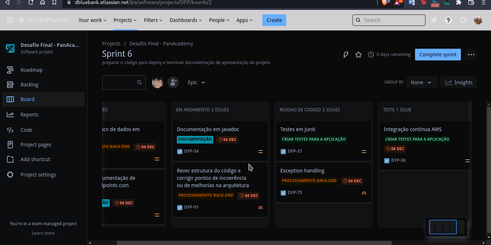

## Gestão do projeto

Seguindo as recomendações da descrição do desafio optamos por usar a ferramenta `Jira`. Pois assim seria mais fácil gerenciar as tarefas tanto com um quadro Kanban para cada sprint quanto para a elaboração de um backlog consistente e bem definido.

### SCRUM

Adotamos uma versão simplificada do SCRUM, uma metodologia para a gestão de projetos que possuem algum grau de dinamicidade. Essa metodologia consiste basicamente de pequenos avanços revisados e corrigidos ao longo do tempo, onde cada avanço é o que chamamos de `Sprint` e suas revisões e correções ocorrem mediante reuniões entre os membros da equipe.

Nossas reuniões ocorrem diariamente para discutir o andamento das atividades atribuídas aos membros do time, ocorrem também ao fim de cada sprint para avaliar o que foi feito e para planejar a sprint seguinte.

### Backlog e Roadmap

O backlog deve ser entendido como um banco de `tarefas` por assim dizer, essas tarefas basicamente podem ser divididas seguindo uma hierarquia ou `níveis de abstração` do problema a ser resolvido. O nível mais alto e mais abstrato é o `Épico`, ele contém uma descrição genérica do que precisa ser feito e serve de base para a concepção das `Histórias`, que são o segundo nível na hierarquia.

As Histórias já possuem um direcionamento mais claro das ações que devem ser tomadas pela equipe, elas tornam possível a visualização de um objetivo claro e tangível e servem de base para a elaboração de tarefas.

As tarefas são o nível de abstração mais baixo da definição das ações que devem ser tomadas para a resolução do problema, elas descrevem ações simples, diretas e concisas que devem ser feitas de modo a resolver uma pequena parte do problema por vez.

o roadmap que usamos no nosso projeto não foi interamente planejado de modo a obedecer a datas, ele é incrementado automaticamente pela plataforma de gestão que escolhemos,`Jira`, à medida que a conclusão de tarefas de cada épico vai ocorrendo ao longo do tempo.

### Quadro Kanban

O quadro utilizado pela equipe possui, além das colunas `to-do`, `doing` e `done`, as colunas de `revisão de código` e de `testes`. 

As tarefas podem passar ou não pelas colunas de revisão de código e de teste, isso depende da sua natureza e da sua complexidade. Tarefas em revisão de código aguardam uma avaliação conjunta dos membros do grupo sobre a implementação das suas funcionalidades. Tarefas em testes aguardam a verificação das suas funcionalidades em testes práticos.

Esse quadro é renovado ao começo de cada `Sprint` e pode conter tarefas de mais de um `Épico` por Sprint.
